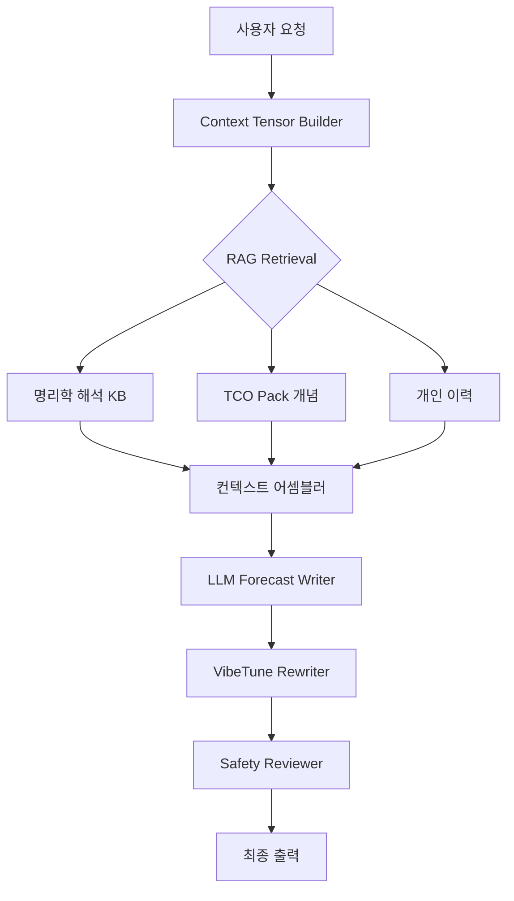

# TCO-Vibe AI 아키텍처 분석 & 개선 제안

## 1. 현재 AI 구성 현황

### 현재 LLM Provider

| 항목 | 현재 값 |
|------|---------|
| **Provider** | OpenAI (via LangChain `@langchain/openai`) |
| **Model** | `gpt-5.5` (env: `OPENAI_MODEL`) |
| **Temperature** | 0.2 (보수적) |
| **출력 방식** | Structured Output (Zod 스키마 → `withStructuredOutput`) |
| **Fallback** | Mock provider (폴백 하드코딩 데이터) |
| **Retry** | 3회 + Exponential Backoff + Circuit Breaker (5회 연속 실패 → 10분 차단) |

### 현재 프롬프트 구조

```
prompts/
├── system.md              → 14줄짜리 간단한 시스템 프롬프트
├── forecast_writer.md     → 23줄짜리 간단한 포캐스트 작성 지침
├── concept_canonicalizer.md
├── policy_binder.md
├── risk_vectorizer.md
├── safety_reviewer.md
├── eval_judge.md
└── run_receipt_summarizer.md
```

> [!WARNING]
> ### 현재 프롬프트의 치명적 문제
> - 시스템 프롬프트가 **14줄**로 극도로 빈약함
> - TCO 개념 체계, 오행 해석, Vibe 상태 해석 등의 **도메인 지식이 전혀 포함되지 않음**
> - RAG/VibeTune이 구현되지 않아 **모든 코멘트가 generic하고 개인화되지 않음**

---

## 2. 고급 모델 전환 제안

### 왜 모델이 중요한가?

TCO-Vibe는 단순 챗봇이 아닙니다. 다음을 동시에 수행해야 합니다:
1. **명리학 도메인 지식** 기반 해석 (오행 상생상극, 십신, 대운 흐름)
2. **비즈니스 코칭** 수준의 행동 정책 생성
3. **심리적 안전** 경계 준수
4. **개인 맞춤** 톤 리라이팅

### 모델 추천

| 모델 | 장점 | 단점 | 추천도 |
|------|------|------|--------|
| **GPT-4o** | 빠르고 저렴, 구조화 출력 우수 | 한국어 명리학 깊이 부족 | ⭐⭐⭐ |
| **GPT-4.5** | 높은 추론 능력, 뉘앙스 잘 잡음 | 비쌈, 느림 | ⭐⭐⭐⭐ |
| **Claude Opus 4** | 한국어 문맥 우수, 긴 프롬프트 처리 | 구조화 출력 별도 처리 필요 | ⭐⭐⭐⭐ |
| **Gemini 2.5 Pro** | Google AI Studio 무료 티어, 긴 컨텍스트 | 명리학 지식 검증 필요 | ⭐⭐⭐ |

> [!TIP]
> **추천**: Multi-model 아키텍처
> - **일반 포캐스트**: GPT-4o (빠름 + 저렴)
> - **VibeTune 리라이팅**: GPT-4.5 또는 Claude Opus 4 (뉘앙스 중요)
> - **안전 검토**: 별도 경량 모델 (빠른 classification)

---

## 3. RAG / GraphRAG 도입 제안

### 3-1. 왜 RAG이 필요한가?

현재 시스템은 LLM에 **컨텍스트 없이** 구조화 출력만 요청합니다. 결과:
- ❌ 사용자 과거 행동 패턴 반영 불가
- ❌ 명리학 해석 깊이 부족 (모델의 사전 학습에만 의존)
- ❌ TCO 팩 개념과 실제 연결 불가
- ❌ 사용자 비즈니스 맥락 무시

### 3-2. RAG 데이터 소스 분류

#### 🌐 퍼블릭 데이터 (Public Knowledge Base)

| 데이터 | 용도 | 형태 |
|--------|------|------|
| **명리학 해석 코퍼스** | 오행 상생상극, 십신 의미, 합충형파해 해석 | 벡터 DB (Supabase pgvector) |
| **TCO Packs** (YAML) | 비즈니스/관계/건강 도메인별 개념 → 행동 매핑 | 구조화 YAML → Embedding |
| **계절/절기 해석** | 월운·일진에 따른 기류 해석 | 정형 데이터 |
| **오행 비즈니스 매핑** | 목=성장, 화=표현, 토=안정, 금=경계, 수=회복 | TCO Pack 내장 |
| **안전 경계 사례** | 위험 표현 패턴, 안전 리라이팅 예시 | 벡터 DB |

#### 🔒 개인 데이터 (Personal Context)

| 데이터 | 용도 | 저장소 |
|--------|------|--------|
| **사주 원국 (ChartResult)** | 기본 구조적 prior | Supabase `birth_profiles` |
| **바이브 체크인 이력** | 감정/에너지 추세 분석 | Supabase `vibe_checkins` |
| **RunReceipt 이력** | 과거 행동 완수율, 반복 패턴 | Supabase `run_receipts` |
| **과거 Forecast 이력** | 이전 조언 대비 실행 결과 비교 | Supabase `forecast_outputs` |
| **사용자 집중 분야** | business/relationship/health 선호도 | localStorage + DB |
| **대운/세운 변화 기록** | 장기 운세 흐름 추적 | 계산 캐시 |

### 3-3. GraphRAG 아키텍처 제안



#### Graph 구조

```
[사주원국] ──has──> [일간: 甲木]
    │                    │
    │                 maps_to
    │                    │
    ├──has──> [오행분포]  [TCO: element.wood.expansion]
    │                    │
    │                 triggers
    │                    │
    └──affects──> [현재운]  [Operator: growth_initiation]
                     │
                  combines
                     │
                 [Vibe State] ──maps_to──> [vibe.high_energy]
                     │
                  produces
                     │
                 [Action Policy]
```

### 3-4. 구현 방식 제안

```
Phase 1: Simple RAG (Supabase pgvector)
├── 명리학 해석 코퍼스 50~100편 임베딩
├── TCO Pack YAML → 벡터화
├── 사용자 이력 최근 7일 자동 주입
└── 프롬프트에 retrieved context 삽입

Phase 2: GraphRAG (Neo4j 또는 Supabase Graph)  
├── 사주-오행-TCO 개념 그래프 구축
├── 개인 이력 노드 연결
├── 그래프 탐색으로 관련 개념 자동 추출
└── 개인화된 operator 자동 매칭
```

---

## 4. VibeTune 톤 리라이팅 제안

### 4-1. VibeTune이란?

사용자의 **현재 Vibe 상태**에 따라 동일한 코멘트도 **톤과 강도를 조절**하는 리라이팅 레이어입니다.

### 4-2. 톤 매핑 매트릭스

| Vibe 상태 | 톤 | 어조 예시 |
|-----------|-----|----------|
| 🔴 **에너지 LOW + 기분 LOW** | 따뜻하고 부드러운 위로조 | "오늘은 무리하지 않아도 됩니다. 할 수 있는 만큼만 해도 충분합니다." |
| 🟡 **에너지 HIGH + 기분 LOW** | 차분하고 명확한 가이드조 | "에너지는 있지만 방향이 흔들리는 구간입니다. 감정보다 구조를 먼저 점검하세요." |
| 🟢 **에너지 HIGH + 기분 HIGH** | 직설적이고 도전적인 코칭조 | "확장에 최적인 구간입니다. 단, 스코프 리크를 먼저 봉쇄하고 전진하세요." |
| 🔵 **에너지 LOW + 기분 HIGH** | 격려하되 절제를 강조 | "기분은 좋지만 체력이 뒷받침되지 않습니다. 오늘의 핵심 1가지만 완결하세요." |

### 4-3. VibeTune Rewriter 노드 설계

```ts
// src/lib/agent/nodes/vibe-rewriter.ts

export type VibeTuneProfile = {
  toneMode: "warmth" | "coaching" | "directive" | "gentle";
  intensityLevel: 1 | 2 | 3;  // 1=부드럽게, 3=직설적
  emphasizeRecovery: boolean;
  emphasizeAction: boolean;
  personalPrefix?: string;  // "오늘의 甲木 일간은..."
};

function determineVibeTuneProfile(vibe: VibeCheckIn): VibeTuneProfile {
  const { energy, valence, arousal, focus, socialLoad } = vibe;
  
  if (energy <= 3 && valence <= 3) {
    return { toneMode: "gentle", intensityLevel: 1, emphasizeRecovery: true, emphasizeAction: false };
  }
  if (energy >= 7 && valence >= 7) {
    return { toneMode: "directive", intensityLevel: 3, emphasizeRecovery: false, emphasizeAction: true };
  }
  if (energy >= 6 && valence <= 4) {
    return { toneMode: "coaching", intensityLevel: 2, emphasizeRecovery: false, emphasizeAction: true };
  }
  return { toneMode: "warmth", intensityLevel: 2, emphasizeRecovery: true, emphasizeAction: false };
}
```

### 4-4. VibeTune Prompt Template

```markdown
## VibeTune Rewriter Instructions

You are rewriting the forecast output to match the user's current vibe state.

Current Vibe Profile:
- Tone Mode: {toneMode}
- Intensity: {intensityLevel}/3
- Emphasize Recovery: {emphasizeRecovery}
- Emphasize Action: {emphasizeAction}
- Day Master: {dayMaster} ({element})

Rules:
1. Keep ALL action policy items intact (do not remove required/forbidden actions)
2. Adjust ONLY the tone, word choice, and emotional framing
3. If recovery mode: add encouraging phrases, reduce pressure language
4. If directive mode: be concise, use imperative sentences
5. Always maintain safety boundaries
6. Add personalized element-based metaphors (e.g., 木→성장, 水→유연)
```

---

## 5. 종합 구현 로드맵

### Phase 1: 프롬프트 고도화 (즉시 가능)
- [ ] 시스템 프롬프트를 300줄 이상으로 확장 (명리학 도메인 지식, TCO 개념 체계 포함)
- [ ] TCO Pack YAML을 프롬프트에 인라인 주입
- [ ] 사주 차트 + 바이브 + 이력을 구조화된 컨텍스트로 조합
- [ ] VibeTune 톤 프로필을 프롬프트에 추가

### Phase 2: RAG 도입 (1~2주)
- [ ] Supabase pgvector 활성화
- [ ] 명리학 해석 코퍼스 50편 임베딩 (오행/십신/합충/신살 해석)
- [ ] TCO Pack 개념 → 벡터 DB
- [ ] 사용자 RunReceipt/ForecastHistory 자동 검색
- [ ] Retrieved context → 프롬프트 주입

### Phase 3: VibeTune Rewriter 노드 (1주)
- [ ] `src/lib/agent/nodes/vibe-rewriter.ts` 구현
- [ ] LangGraph 워크플로에 Rewriter 노드 추가
- [ ] 톤 매핑 매트릭스 구현
- [ ] A/B 테스트용 with/without VibeTune 비교

### Phase 4: GraphRAG (2~3주)
- [ ] 사주-오행-TCO 개념 그래프 스키마 설계
- [ ] Neo4j 또는 Supabase Graph 연동
- [ ] 그래프 탐색 기반 관련 개념 자동 추출
- [ ] 장기 개인화 패턴 학습

### Phase 5: Multi-Model (선택)
- [ ] 포캐스트 생성: GPT-4o (빠름)
- [ ] VibeTune 리라이팅: GPT-4.5/Claude (뉘앙스)
- [ ] Safety Review: 경량 classifier
- [ ] 모델 라우팅 로직 구현

---

## 6. 예상 효과

| 개선 항목 | 현재 | 개선 후 |
|-----------|------|---------|
| 코멘트 개인화 | ❌ 없음 (하드코딩 폴백) | ✅ 사주+바이브+이력 기반 |
| 명리학 해석 깊이 | ❌ 모델 사전학습만 의존 | ✅ RAG로 검증된 해석 주입 |
| 톤 조절 | ❌ 일률적 어조 | ✅ VibeTune 4단계 톤 |
| 과거 이력 반영 | △ Recomposition 기초만 | ✅ 7일/30일 이력 RAG |
| TCO 개념 활용 | ❌ YAML 파일만 존재 | ✅ 개념 → 행동 자동 매핑 |

> [!IMPORTANT]
> **가장 즉각적으로 효과가 큰 개선**: Phase 1 (프롬프트 고도화) + Phase 3 (VibeTune)
> 이 두 가지만으로도 코멘트 품질이 **비약적으로 향상**됩니다.
